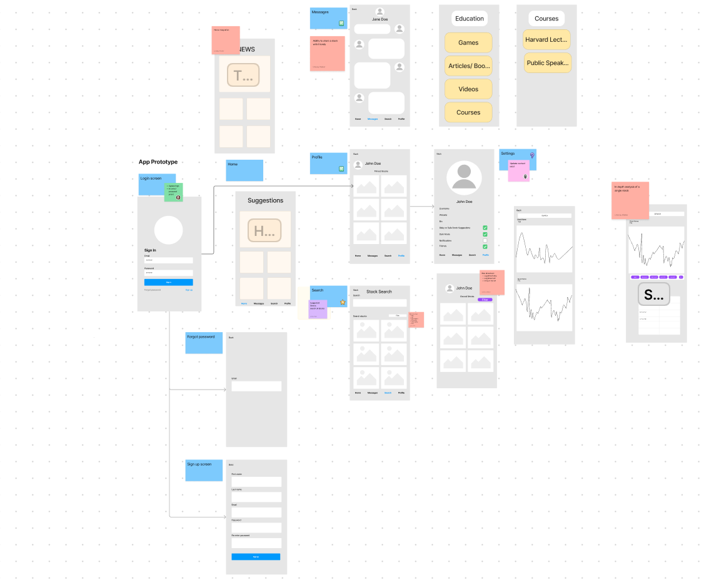

# Trenz - Your Personal Stock Analysis

Welcome to Trenz, a full-stack analytical application optimized for web first. Trens allows users to customize their preffered trading type and gives them reccomendations on stock to buy based on the current trend of the stock.

## Features

- **User Profiles:** Create and customize your user profile with personal information and investment style preferences.
- **Reccommended Stocks:** Access your personalized stock reccommendations with your individualized trading strategy.
- **Stock Search:** Explore and discover new stocks through search and filter.
- **Detailed Stock Analysis:** Create, edit, and delete events with full CRUD capabilities directly from your calendar. Full CRUD exists on the backend across the event and user schemas.
- **User Interactivity:** Create, edit, and delete your profile with full CRUD capabilities directly from your user home. Full CRUD exists on the backend as well across the user schema.

## Wireframe

## Stretch Goals
1. Find and add Friends
2. Message friends
3. Create a forum/group and post stock tips for your group to see
4. Buy and sell stocks with integration of trading applications
5. Education platform to bring investment books, websites, video lectures, and courses all to one place for easy learning.
6. Gamify the learning process through market quizes and games.

## Contributors

**Lindsay Walker**

## Programming Languages/Technologies

**Django:** A database for storing user data.
  
**React:** A JavaScript library for building a dynamic and interactive user interface.
  
**Node.js:** A server-side runtime environment for executing JavaScript.
  
**Web View Optimization:** The application is designed with a web view-first approach for a seamless user experience.

**Vite:** The tooling used for frontend development.
  
**Auth0:** Authentication and authorization platform.
  
**Bootstrap:** Front-end framework for designing responsive and mobile-first applications.
  
**FontAwesome:** Icon set and toolkit for web development.
  
**Axios:** Promise-based HTTP client for the browser and Node.js.

---

